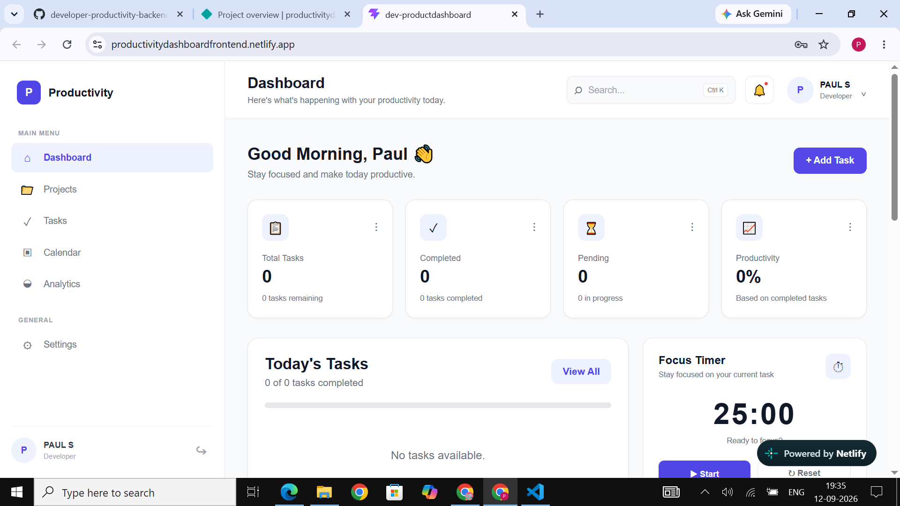
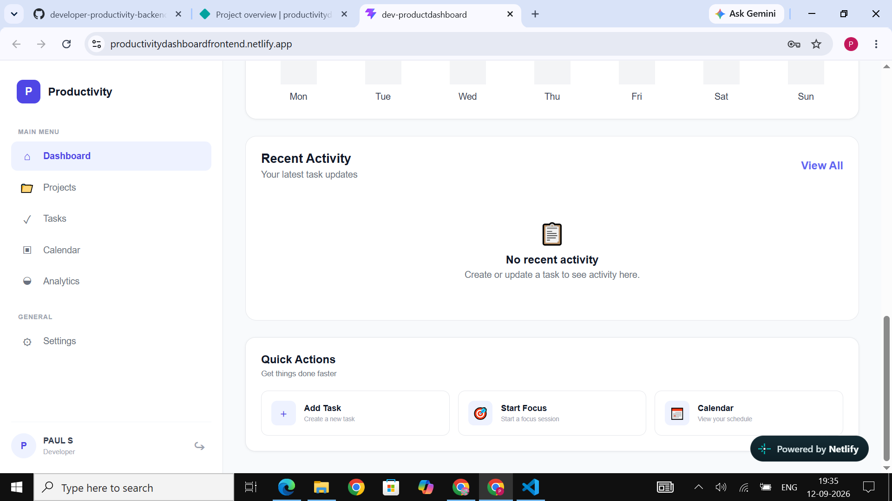
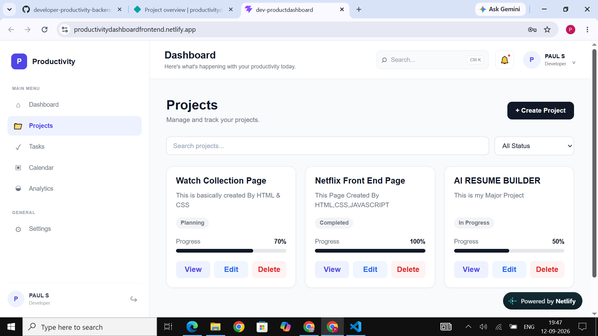
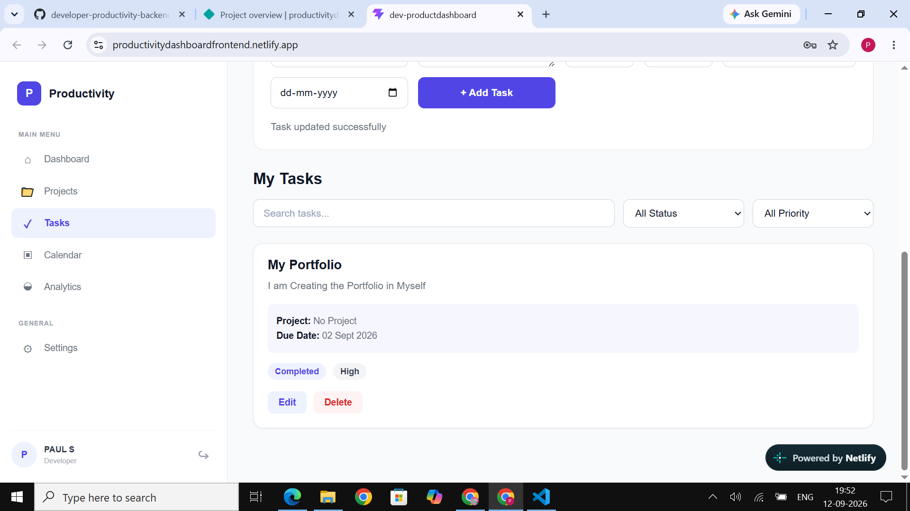
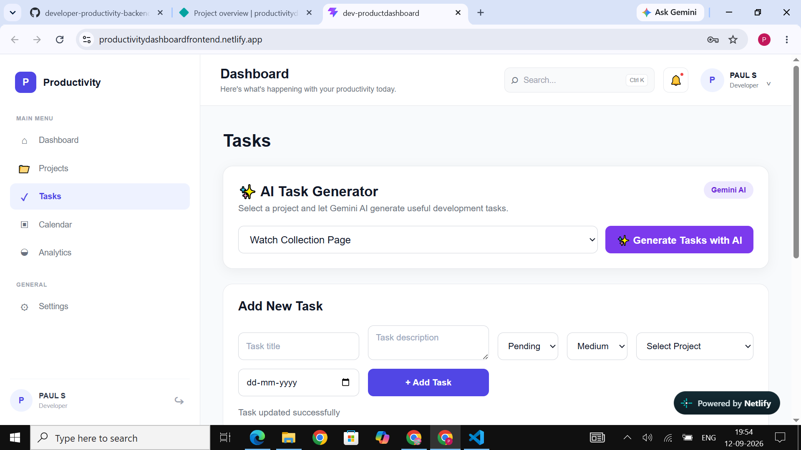
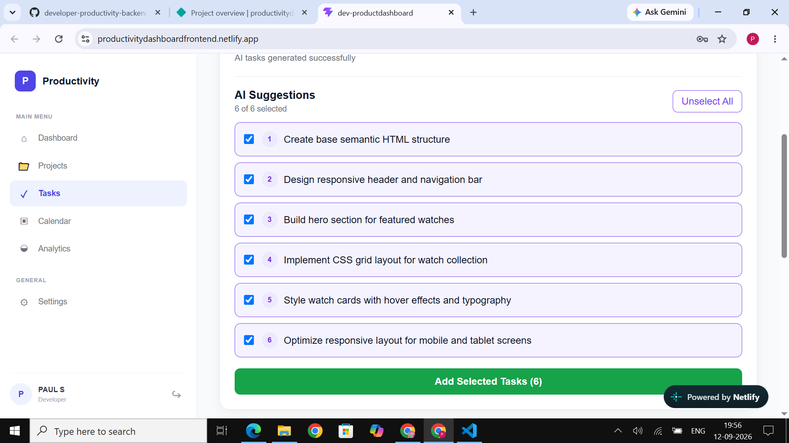

# Developer Productivity Dashboard - Backend

Backend REST API for the **AI-Powered Developer Productivity Dashboard**, built using Node.js, Express.js, MongoDB, and Google Gemini AI.

The backend provides secure authentication, user management, project management, task management, MongoDB data persistence, and AI-assisted task generation.

---

## Features

### Authentication & User Management

- User registration
- User login
- JWT authentication
- Protected routes
- Get user profile
- Update user profile
- Delete user account
- Password hashing using bcryptjs

### Project Management

- Create projects
- View projects
- Update projects
- Delete projects
- Project status management
- Project progress tracking
- User-to-project relationship

### Task Management

- Create tasks
- View tasks
- Update tasks
- Delete tasks
- Assign tasks to projects
- Task status management
- Task priority management
- Due date support
- Project-to-task relationship

### AI-Powered Feature

The application includes **AI-Assisted Task Generation** using the Google Gemini API.

Users can select a project and generate relevant software development task suggestions based on the project's name and description.

AI-generated tasks can then be selected by the user and saved as regular tasks in MongoDB.

### Additional Backend Features

- RESTful API architecture
- MongoDB data persistence
- Mongoose schema validation
- Mongoose relationships and populate
- Centralized error handling
- Environment-based configuration
- Secure API key management

---

## Technology Stack

- Node.js
- Express.js
- MongoDB Atlas
- Mongoose
- JSON Web Token (JWT)
- bcryptjs
- Google Gemini API
- `@google/genai`
- dotenv
- CORS
- Nodemon

---

## Project Architecture

```text
React Frontend
      |
      | Axios HTTP Requests
      v
Node.js + Express REST API
      |
      +------> Google Gemini API
      |
      v
Mongoose
      |
      v
MongoDB Atlas
```

---

## Installation

### 1. Clone the repository

```bash
git clone <your-backend-repository-url>
```

### 2. Open the backend directory

```bash
cd developer-productivity-backend
```

### 3. Install dependencies

```bash
npm install
```

### 4. Configure environment variables

Create a `.env` file in the backend root directory.

Use `.env.example` as the reference.

```env
PORT=5000
MONGO_URI=your_mongodb_connection_string
JWT_SECRET=your_jwt_secret
GEMINI_API_KEY=your_gemini_api_key
```

Never commit real environment variable values or API keys to GitHub.

### 5. Start the development server

```bash
npm run dev
```

The backend will run locally at:

```text
http://localhost:5000
```

---

## Environment Variables

The project requires the following environment variables:

| Variable | Description |
|---|---|
| `PORT` | Backend server port |
| `MONGO_URI` | MongoDB Atlas connection string |
| `JWT_SECRET` | Secret used for JWT authentication |
| `GEMINI_API_KEY` | Google Gemini API key for AI task generation |

A `.env.example` file is included in the repository with placeholder values.

---

## API Endpoints

### Authentication

| Method | Endpoint | Description |
|---|---|---|
| POST | `/api/auth/signup` | Register a new user |
| POST | `/api/auth/login` | Login user |
| GET | `/api/auth/profile` | Get logged-in user profile |
| PUT | `/api/auth/profile` | Update user profile |
| DELETE | `/api/auth/profile` | Delete user account |

### Projects

| Method | Endpoint | Description |
|---|---|---|
| POST | `/api/projects` | Create a project |
| GET | `/api/projects` | Get user projects |
| PUT | `/api/projects/:id` | Update a project |
| DELETE | `/api/projects/:id` | Delete a project |

### Tasks

| Method | Endpoint | Description |
|---|---|---|
| POST | `/api/tasks` | Create a task |
| GET | `/api/tasks` | Get user tasks |
| PUT | `/api/tasks/:id` | Update a task |
| DELETE | `/api/tasks/:id` | Delete a task |

### AI

| Method | Endpoint | Description |
|---|---|---|
| POST | `/api/ai/generate-tasks` | Generate project-specific tasks using Gemini AI |

The AI endpoint requires JWT authentication.

Example request:

```json
{
  "projectName": "E-Commerce Website",
  "description": "A MERN stack shopping application with authentication, products, cart and payment"
}
```

Example response:

```json
{
  "message": "AI tasks generated successfully",
  "tasks": [
    "Implement user authentication",
    "Develop product catalog APIs",
    "Build product listing interface",
    "Implement shopping cart",
    "Integrate payment processing",
    "Create order management"
  ]
}
```

---

## Database Relationships

The application uses MongoDB ObjectId references to connect users, projects, and tasks.

```text
User
 |
 +---- Projects
 |
 +---- Tasks
         |
         +---- Project
```

Each project belongs to a user.

Each task belongs to a user and can optionally be assigned to a project.

Mongoose `populate()` is used to retrieve related project information with tasks.

---

## HTTP Status Codes

| Status Code | Meaning |
|---|---|
| `200` | Success |
| `201` | Resource created |
| `400` | Bad request |
| `401` | Unauthorized |
| `404` | Resource not found |
| `409` | Conflict |
| `500` | Internal server error |

---

## Security

- User passwords are hashed using bcryptjs.
- Protected routes require JWT authentication.
- User-specific resources are protected using authenticated user IDs.
- MongoDB credentials are stored using environment variables.
- Gemini API credentials are stored using environment variables.
- Real `.env` files are excluded from Git using `.gitignore`.
- No passwords, JWT secrets, database credentials, or API keys are hard-coded in the source code.

---

## Deployment

The backend is deployed using **Render**.

The production architecture is:

```text
Netlify Frontend
       |
       v
Render Backend
       |
       +------> Gemini AI
       |
       v
MongoDB Atlas
```

---

## Screenshots

### Dashboard Overview


### Dashboard Recent Activity


### Project Management


### Task Management


### AI Task Generator


### AI Generated Suggestions


### API Testing

Add screenshots showing:

- Authentication API
- Project CRUD
- Task CRUD
- Gemini AI task generation

### Application

Add screenshots showing:

- Dashboard
- Project management
- Task management
- AI Task Generator

---

## Demo Video

[Watch the Task 4 Project Demo](https://drive.google.com/file/d/1rO0qPAEdjvHfYWsoT407kqebiFYEIEBU/view?usp=drive_link)

## Project Status

The backend implementation includes:

- Authentication
- User CRUD
- Project CRUD
- Task CRUD
- MongoDB persistence
- Database relationships
- Schema validation
- Gemini AI-assisted task generation
- Render deployment

---

## Author

Developed as part of the **Innovation Hacks Full Stack Development Internship**.